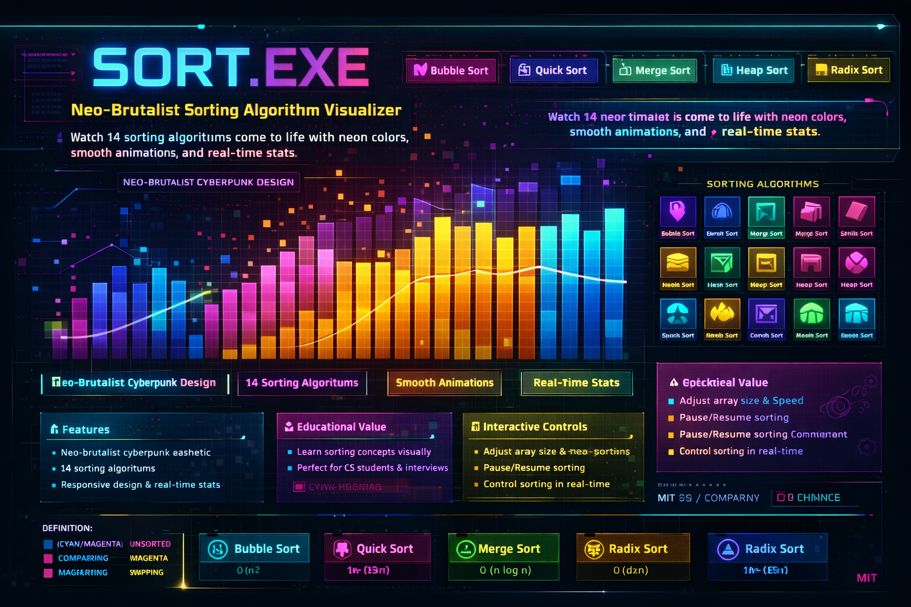

# SORT.EXE - Neo-Brutalist Sorting Algorithm Visualizer

A modern, visually stunning sorting algorithm visualizer with a cyberpunk aesthetic. Watch 14 different sorting algorithms come to life with neon colors, smooth animations, and real-time statistics.



## 🎨 Features

### Visual Design
- **Neo-brutalist cyberpunk aesthetic** with neon cyan, magenta, and yellow color scheme
- **Glitch effects** and scanline overlays for authentic terminal feel
- **Smooth animations** with color-coded states (comparing, swapping, sorted, pivot)
- **Responsive design** that works seamlessly on desktop and mobile devices

### Sorting Algorithms (14 Total)

#### Comparison-Based Sorts
- **Bubble Sort** - O(n²) - Simple comparison-based algorithm
- **Selection Sort** - O(n²) - Finds minimum element repeatedly
- **Insertion Sort** - O(n²) - Builds sorted array one element at a time
- **Merge Sort** - O(n log n) - Divide and conquer approach
- **Quick Sort** - O(n log n) average - Partition-based sorting
- **Heap Sort** - O(n log n) - Binary heap data structure
- **Shell Sort** - O(n log n) to O(n²) - Gap-based insertion sort
- **Cocktail Sort** - O(n²) - Bidirectional bubble sort
- **Comb Sort** - O(n²/2^p) - Improved bubble sort with gap
- **Gnome Sort** - O(n²) - Simple position-based swapping

#### Non-Comparison Sorts
- **Counting Sort** - O(n+k) - Integer sorting by counting
- **Radix Sort** - O(d×n) - Digit-by-digit sorting
- **Bucket Sort** - O(n+k) - Distribution-based sorting

#### Other Algorithms
- **Cycle Sort** - O(n²) - Minimal write operations

### Interactive Controls
- **Adjustable array size** (10-150 elements)
- **Variable speed control** (1-200ms delay)
- **Pause/Resume** functionality during sorting
- **Real-time statistics** tracking:
  - Number of comparisons
  - Array access count
  - Elapsed time in milliseconds

## 🚀 Quick Start

Simply open the HTML file in any modern web browser:
```bash
# Clone the repository
git clone https://github.com/Abhiram473/index.git

# Navigate to the directory
cd index

# Open in browser
open index.html
```

Or visit the live demo: https://abhiram473.github.io/Sorting_Visualizer/

## 🎮 How to Use

1. **Select an Algorithm** - Click on any of the 14 algorithm buttons
2. **Configure Settings** - Adjust array size and animation speed using sliders
3. **Start Sorting** - Press the "START" button to begin visualization
4. **Control Playback** - Use PAUSE/RESUME to control the animation
5. **Reset** - Click RESET to generate a new random array

## 🎯 Color Legend

- **Cyan/Magenta Gradient** - Unsorted elements
- **Cyan** - Elements being compared
- **Magenta** - Elements being swapped
- **Yellow** - Pivot element (Quick Sort)
- **Green** - Sorted elements

## 🛠️ Technologies Used

- **Pure HTML5/CSS3/JavaScript** - No external dependencies
- **Custom Fonts** - Orbitron & JetBrains Mono from Google Fonts
- **CSS Animations** - Smooth transitions and effects
- **Async/Await** - For animation timing control

## 📊 Algorithm Complexity Reference

| Algorithm | Best | Average | Worst | Space | Stable |
|-----------|------|---------|-------|-------|--------|
| Bubble | O(n) | O(n²) | O(n²) | O(1) | ✓ |
| Selection | O(n²) | O(n²) | O(n²) | O(1) | ✗ |
| Insertion | O(n) | O(n²) | O(n²) | O(1) | ✓ |
| Merge | O(n log n) | O(n log n) | O(n log n) | O(n) | ✓ |
| Quick | O(n log n) | O(n log n) | O(n²) | O(log n) | ✗ |
| Heap | O(n log n) | O(n log n) | O(n log n) | O(1) | ✗ |
| Shell | O(n log n) | O(n^1.3) | O(n²) | O(1) | ✗ |
| Counting | O(n+k) | O(n+k) | O(n+k) | O(k) | ✓ |
| Radix | O(d×n) | O(d×n) | O(d×n) | O(n+k) | ✓ |
| Bucket | O(n+k) | O(n+k) | O(n²) | O(n) | ✓ |

## 🎓 Educational Value

Perfect for:
- Computer Science students learning algorithms
- Technical interview preparation
- Teaching sorting algorithm concepts
- Understanding time complexity differences
- Visual learners who benefit from animations

## 🤝 Contributing

Contributions are welcome! Feel free to:
- Add new sorting algorithms
- Improve animations and visual effects
- Enhance mobile responsiveness
- Fix bugs or optimize code
- Improve documentation

## 📝 License

MIT License - feel free to use this project for educational purposes

## 🌟 Acknowledgments

- Inspired by classic sorting visualizers with a modern twist
- Built with a focus on aesthetic design and user experience
- Created to make learning algorithms more engaging and fun

---

**⭐ If you find this project helpful, please give it a star!**

Made with 💜 by Abhiram
```

And here's a short description for the GitHub repository settings:

**Short Description (160 characters):**
```
Neo-brutalist sorting algorithm visualizer with 14 algorithms, neon cyberpunk design, real-time stats, and smooth animations. Educational & visually stunning.
```

**Topics/Tags:**
```
sorting-algorithms
data-structures
algorithm-visualization
educational
javascript
html5
css3
visualization
cyberpunk
web-app
computer-science
dsa
sorting
interactive
animations
